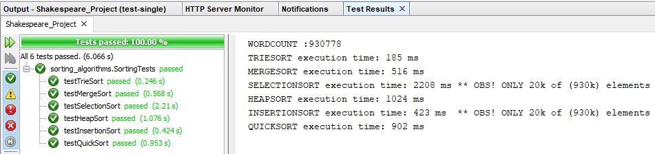

# Algorithms and Data Structures - Mini Project #1 - Sorting Shakespeare’s complete works 

https://datsoftlyngby.github.io/soft2020spring/resources/d34f80c6-01-miniproject-sorting-shakespeare.pdf

## Results

Executing SortingTests.java that demo's our Triesort, Mergesort, Selectionsort, Heapsort, Insertionsort and Quicksort algorithms, when used to sort Shakespeare’s complete works.

Note that SelectionSort and Insertionsort results are for the sorting of a subset of words (20k of 930k), as they are very slow. They are included this way to show that they actually work.

Screenshot from IDE:


Results:
````
WORDCOUNT :930778
TRIESORT execution time: 185 ms
MERGESORT execution time: 516 ms
SELECTIONSORT execution time: 2208 ms ** OBS! ONLY 20k of (930k) elements
HEAPSORT execution time: 1024 ms
INSERTIONSORT execution time: 423 ms  ** OBS! ONLY 20k of (930k) elements
QUICKSORT execution time: 902 ms
````


## Author Details

**Group: Team Wing It**
- *Alexander Winther Hørsted-Andersen* (cph-ah353@cphbusiness.dk)
- *Mathias Bigler* (cph-mb493@cphbusiness.dk)
- *Stanislav Novitski* (cph-sn183@cphbusiness.dk)